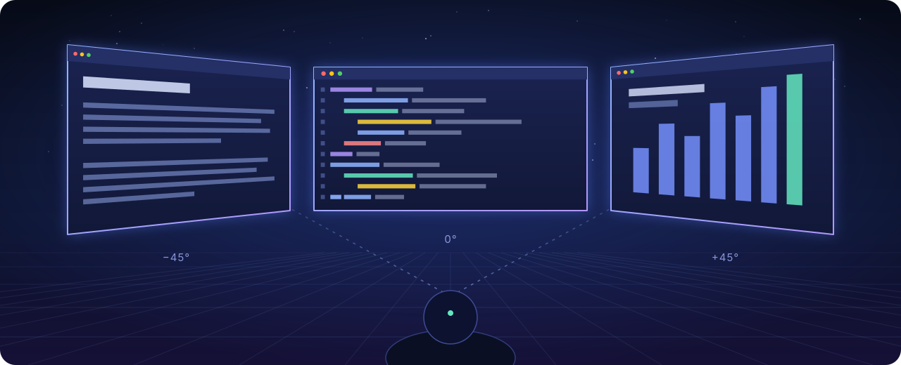
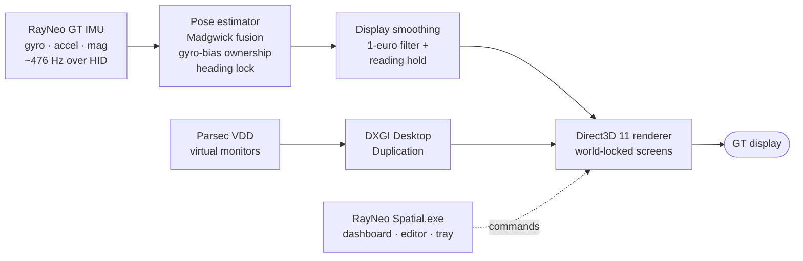

<div align="center">

# RayNeo Spatial

**Turn a pair of RayNeo GT glasses into a multi-monitor Windows workspace that floats around you.**

Real Windows desktops, world-locked in space, head-tracked from the glasses' own IMU,
with a magnetometer lock that keeps them from drifting over hours of use.

[](#requirements)
[](CMakeLists.txt)
[](src/render/)
[](#tests)
[](LICENSE)



</div>

---

## Highlights

<table>
<tr>
<td width="50%" valign="top">

### 🖥️ Real desktops, not mirrors
Creates genuine Windows monitors through the Parsec Virtual Display Driver. Drag apps onto
them as you would onto a physical screen. The default layout is three screens at −45°, 0° and
+45°, and you can arrange anything from 1 to 8.

</td>
<td width="50%" valign="top">

### 🧭 Stays where you put it
A 3DoF pose estimator runs on the glasses' ~476 Hz IMU. A one-time magnetometer calibration
locks heading to the local magnetic field. In a measured 22-minute session the lock removed
about 20° of thermal gyro drift.

</td>
</tr>
<tr>
<td valign="top">

### 📖 Steady enough to read small text
A soft reading hold settles the view while your head is still, like electronic image
stabilisation, and never makes deliberate turns feel sticky. Choose Off, Low, Medium, High or
Ultra, live, from the dashboard or with a hotkey.

</td>
<td valign="top">

### 🌙 Comfortable for long sessions
Optional per-screen dimming: set each screen yourself, or let the screens you aren't looking
at fade. Add a warm night tint, and pull the cursor home to the centre screen with
<kbd>Ctrl</kbd>+<kbd>Alt</kbd>+<kbd>F</kbd>.

</td>
</tr>
<tr>
<td valign="top">

### 🎛️ A native control centre
A Win32 dashboard with a 3D layout editor, presets, live engine controls, a tray icon and
health checks for the glasses, the calibration, the driver and the engine.

</td>
<td valign="top">

### 🧾 Logs that are there when you need them
Every session longer than 10 minutes is compressed into `logs/sessions/` automatically, and
the last three are kept. Each archive can be replayed through the real estimator offline.

</td>
</tr>
</table>

## How it works



`RayNeo Spatial.exe` is the controller. It launches and steers `spatial_desk.exe`, the rendering
engine. The engine takes over the display topology, creates the virtual monitors, captures each
one, and draws them on the glasses from the head pose. When you stop, it restores your original
display arrangement. `orientation_calibrate.exe` measures how the sensor sits on your head.

## Requirements

| | |
|---|---|
| **Glasses** | RayNeo GT, set to **Extend** (<kbd>Win</kbd>+<kbd>P</kbd>) so they appear as a separate display. 1920×1080 at 120 Hz gives the best feel. |
| **OS** | Windows 10 (1809 or later) or Windows 11, x64 |
| **Virtual monitors** | The signed [Parsec VDD](https://github.com/nomi-san/parsec-vdd), installed by you (it is never bundled or installed by this project). Without it, **Start preview** still renders labelled test screens. |
| **Build tools** | Visual Studio 2022 Build Tools (C++), CMake 3.25+, Ninja and [vcpkg](https://github.com/microsoft/vcpkg). The manifest pulls in `hidapi` and `nlohmann-json`. |

## Quick start

**1. Build and test.** From a *Developer Command Prompt for VS 2022*:

```cmd
set "VCPKG_ROOT=C:\path\to\vcpkg"
cmake -S . -B build\rayneo -G Ninja -DCMAKE_BUILD_TYPE=RelWithDebInfo -DCMAKE_TOOLCHAIN_FILE="%VCPKG_ROOT%\scripts\buildsystems\vcpkg.cmake"
cmake --build build\rayneo
ctest --test-dir build\rayneo --output-on-failure
```

**2. Stage a portable folder.** It holds the controller, engine, calibration tool, config and docs:

```powershell
powershell -ExecutionPolicy Bypass -File scripts\stage-portable.ps1 -BuildDir build\rayneo
```

**3. Calibrate once, wearing the glasses.** Start `dist\RayNeoSpatial\RayNeo Spatial.exe` and
choose **Run calibration**. Then run the magnetometer step from the same folder for drift-free
heading (turn fully around and nod when prompted):

```cmd
dist\RayNeoSpatial\orientation_calibrate.exe --mag
```

**4. Start workspace.** Your virtual desktops appear around you. Look straight ahead and press
<kbd>Ctrl</kbd>+<kbd>Shift</kbd>+<kbd>R</kbd> any time to recenter.

> [!NOTE]
> Calibration is per device and per wearer. It is saved as `config/orientation.json` in the
> running folder and deliberately kept out of Git.

## Hotkeys

| Keys | Action |
|---|---|
| <kbd>Ctrl</kbd>+<kbd>Shift</kbd>+<kbd>R</kbd> | Recenter the workspace in front of you |
| <kbd>Ctrl</kbd>+<kbd>Alt</kbd>+<kbd>S</kbd> | Cycle reading stabilisation: Off → Low → Medium → High → Ultra |
| <kbd>Ctrl</kbd>+<kbd>Alt</kbd>+<kbd>F</kbd> | Move the cursor to the middle of the centre screen |
| <kbd>Ctrl</kbd>+<kbd>Alt</kbd>+<kbd>Y</kbd> / <kbd>P</kbd> | Toggle yaw / pitch tracking (off holds the view on that axis) |
| <kbd>Ctrl</kbd>+<kbd>Shift</kbd>+<kbd>\\</kbd> | Exit workspace mode |
| <kbd>Ctrl</kbd>+<kbd>Alt</kbd>+<kbd>Q</kbd> | Quit the engine |

## Reading stabilisation, measured

Replaying a recorded worn session (235 s of reading) through the real smoother:

| Level | Text motion while reading | Turn lag (rms) |
|---|---:|---:|
| Off | 31.0 px/s | 1.18° |
| Low | 11.1 px/s | 1.40° |
| Medium | 6.7 px/s | 1.57° |
| High | 5.2 px/s | 1.71° |

**Ultra** goes further. On a second recorded session (266 s of reading) it cut High's 5.4 px/s to
**2.3 px/s**, at the cost of more lag on turns (1.70° → 2.59° rms).

The hold works only on the displayed view. It never feeds back into the estimator, so tracking
accuracy is the same at every level.

## Logs and diagnostics

The dashboard shows live status for the glasses display, the HID device, the calibration, the
driver, the layout and the engine. Each session writes to `logs/`:

| File | Contents |
|---|---|
| `engine.log` | The engine's console output |
| `telemetry.csv` | Pose, bias, rest and adaptation state (the dashboard reads the newest row) |
| `imu_raw.csv` | Every IMU sample, for offline replay |
| `sessions/session-YYYY-MM-DD_HH-MM-SS.zip` | Sessions longer than 10 minutes, compressed; the newest three are kept |

Sessions start on fresh files. Shorter sessions are not archived. The compression runs in the
background after you quit, and anything interrupted is finished the next time the app starts.
To investigate a session, extract its `imu_raw.csv` and replay it through the real estimator
with `imu_replay` from your build folder:

```cmd
build\rayneo\imu_replay.exe imu_raw.csv --orientation config\orientation.json --observe --stats
```

## Tests

Ten CTest suites run offline in about a second:

| Suite | What it proves |
|---|---|
| `camera_selftest` | Frame conversion between the Z-up sensor and the Y-up renderer |
| `pose_selftest` | Recenter coupling, startup calibration, bias bounds, drift behaviour |
| `pose_scenarios` | 19 synthetic worn-head scenarios through the real estimator, from micro-adjustments to 5-minute sessions |
| `mag_heading_selftest` | The heading-lock control loop and the hard-iron fit |
| `orientation_calibration_selftest` | Guided-calibration maths and rejection gates |
| `protocol_selftest` | The GT's HID framing and nine-axis report decoding |
| `layout_selftest` | Layout parsing, validation and geometry |
| `vdd_selftest` | Parsec VDD protocol and display-topology logic |
| `view_selftest` | "Virtual glasses": the real layout and camera projected to the screen |
| `app_selftest` | The controller: config, presets, engine protocol, view comfort, the session log archive |

## Repository guide

| Path | Purpose |
|---|---|
| [`src/imu/`](src/imu/) | HID protocol, calibration, fusion, pose estimator, heading lock, smoother |
| [`src/render/`](src/render/) | Camera transform, screen geometry, D3D11 renderer |
| [`src/capture/`](src/capture/) | DXGI Desktop Duplication with a GDI fallback |
| [`src/vdd/`](src/vdd/) | Parsec VDD client and display-topology takeover and restore |
| [`src/layout/`](src/layout/) | Layout schema, validation, persistence |
| [`src/app/`](src/app/) | The engine, its command protocol and the view-comfort model |
| [`src/app_shell/`](src/app_shell/) | The Win32 dashboard, tray, engine lifecycle and diagnostics |
| [`src/tools/`](src/tools/) | Calibration, probe, replay and test executables |
| [`docs/`](docs/) | [Windows app guide](docs/WINDOWS-APP.md) · [protocol notes](docs/PROTOCOL-NOTES.md) · [orientation calibration](docs/orientation-calibration.md) |
| [`AGENTS.md`](AGENTS.md) | Engineering notebook: invariants, the full bug history and every tuning trade-off with its measurement |

## Design notes

- **Frames are explicit.** The fused quaternion is right-handed with Z up; the Direct3D scene is
  left-handed with Y up. One exact basis change connects them, and the relative rotation is taken
  in the earth frame with its heading split out, so recentering with a tilted head never turns a
  nod into a roll.
- **One owner for steady error.** Gyro-bias adaptation is the only thing allowed to remove drift,
  and the published pose is always live: rest detection gates *adaptation*, never the pose, so
  sub-degree head movements are never swallowed.
- **Measured, not guessed.** Every gate and constant was chosen against a recorded failure, and
  each fix comes with a scenario that fails before it and passes after.
  [AGENTS.md](AGENTS.md) tells the whole story.

## Limitations

- Without the magnetometer calibration there is no absolute heading reference, so a very slow,
  steady turn is indistinguishable from gyro drift. The estimator favours your deliberate pans,
  and recenter is one keypress away.
- A magnetic field that changes while you work (a magnet, a speaker, a laptop lid moving near your
  head) is detected and ignored rather than corrected.
- The glasses must be in Extend mode; duplicate or single-display modes hide them from the engine.

## Contributing

Issues and pull requests are welcome. Please read [AGENTS.md](AGENTS.md) first: it lists the
invariants that must not break, and the IMU path expects a regression scenario with every change.

## License

Copyright 2026 Akshay Reddy Gujjula. Licensed under the [Apache License 2.0](LICENSE).

RayNeo Spatial is an independent project, not an official RayNeo product. It builds on
[hidapi](https://github.com/libusb/hidapi) and [nlohmann/json](https://github.com/nlohmann/json),
and speaks the protocol of the separately installed [Parsec VDD](https://github.com/nomi-san/parsec-vdd).
See the [third-party notices](docs/THIRD_PARTY_NOTICES.md).
